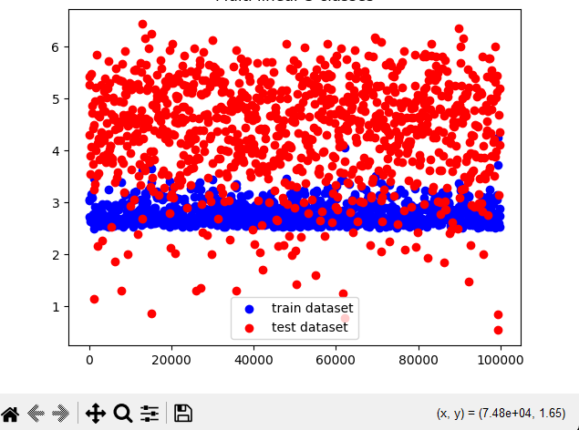
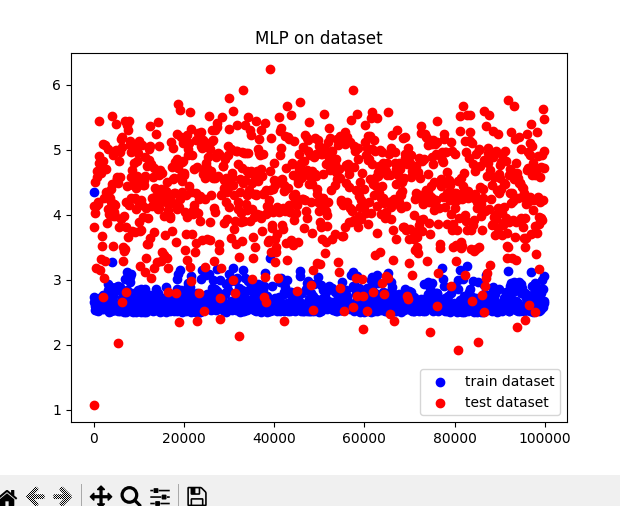
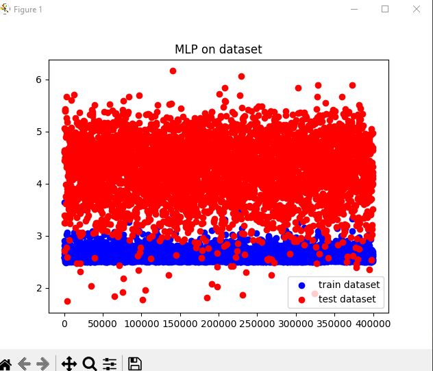
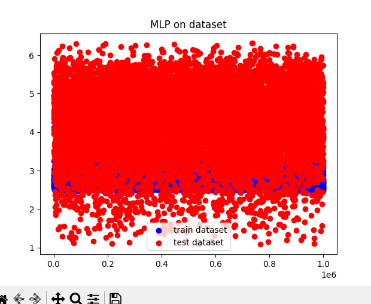

### ALL TEST ON DATASET

### Test on MLP

- npl = (100 * 100 * 3, 2, 3)
- learning rate = 0.1
- step = 100000
##

- npl = (100 * 100 * 3, 2, 4, 2, 3)
- learning rate = 0.1
- step = 100000
##

- npl = (100 * 100 * 3, 10, 5, 3)
- learning rate = 0.04
- step = 400000
##

- npl = (100 * 100 * 3, 100, 3)
- learning rate = 0.05
- step = 1000000

##

Après avoir mieux analysé notre dataset nous nous sommes rendu compte que notre résultat était erroné car toutes les données étaient triées et nous prenions seulement les 300 dernières images pour le test, qui était tout de la même espece. Le dataset était donc non régulier ce qui explique ces résultats.

